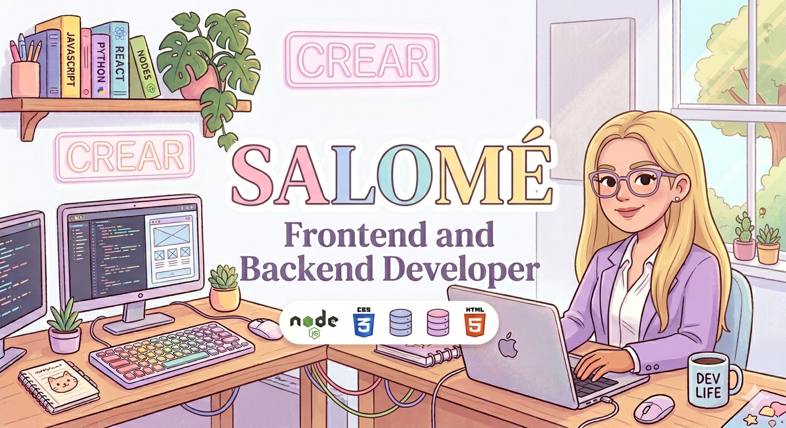

  

# 👩‍💻 Salomé Soto Vélez

### Web Developer | React Certified | JavaScript | Node.js 🚀

✨ "Turning ideas into real-world applications through code"

---

## 👩‍💻 About Me

- 💻 Full Stack Developer (Frontend + Backend)  
- ⚛️ Certified in React JS  
- 🚗 Currently building ParkApp  
- 📚 Constant learner and tech enthusiast  
- 🤝 Teamwork and problem-solving oriented  

---

## 🛠️ Tech Stack

**Frontend:**  
HTML • CSS • JavaScript • Angular • React  

**Backend:**  
Node.js • Express  

**Database:**  
PostgreSQL • Prisma  

**Tools:**  
Git • GitHub • Postman  

---

## 📱 Featured Project

🚗 **ParkApp**  
A full-featured parking management application:

- User authentication  
- Reservations system  
- Payment integration  
- Smart search & filters  
- Notifications & real-time features  
- Maps integration (Google Maps / Waze)  

---

## 📊 GitHub Stats

---

## 🔥 GitHub Streak

---

## 🧠 Top Languages

---

## 🎯 Goals

- Grow as a Software Developer  
- Master React and modern architectures  
- Build scalable and impactful applications  
